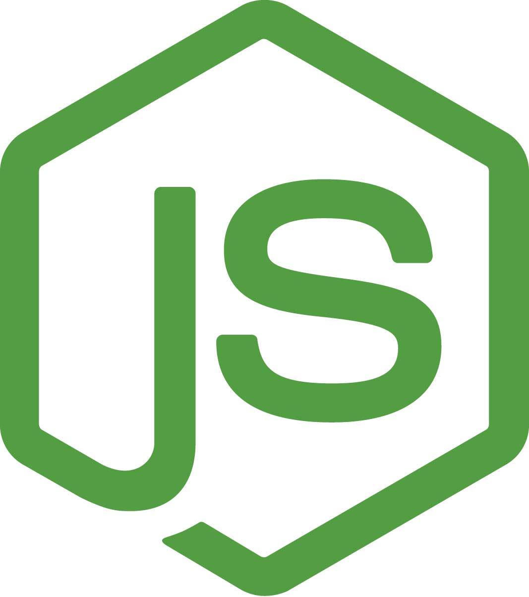

# Student Resources

[Return to NodeJs](../README.md)

 

### Terminology & Links

01. [Node](#node)
02. [Internal Packages](#internal-package)
03. [External Packages](#external-packages)
04. [package.json](#package.json)
05. [ES6](#ES6)

### General Resources
01.  [Nodejs Documentation](https://nodejs.org/api/)
02.  [npm Documentation](https://docs.npmjs.com/)

## Overview

You’ve arrived at another important milestone in your journey. The JavaScript you wrote for your first project was executed entirely on the client side, though it used third-party server-side APIs. In this and later units, you’ll learn how to write your own server-side applications to handle requests and ultimately to build your own APIs.

In a previous era, this would be the point when you’d begin learning a second programming language, like PHP, to write server-side code. Luckily, Node.js&mdash;released in 2009&mdash;makes this unnecessary. Node.js is an implementation of the V8 JavaScript engine without Chrome. It allows you to write server-side code using JavaScript. This means that you no longer need a browser to run JavaScript. You can (and will) do so from the command line!

In this unit, you’ll learn how to initialize a Node.js project, install third-party dependencies, and create interactive command-line applications. Node.js ships with a **standard library**. The standard library contains a number of modules that allow you to extend the functionality of Node.js, like `fs`, which you’ll use to read and write files. You’ll also learn how to add a large and robust ecosystem of third-party modules to applications to extend their functionality.

#### Node

[Back to top](#student-resources)

* [Node.js](https://en.wikipedia.org/wiki/Node.js)
* [Event-driven architecture](https://en.wikipedia.org/wiki/Event-driven_architecture)
* [Node File System Documentation](https://nodejs.org/api/fs.html)

#### Internal Packages

[Back to top](#student-resources)

* process.argv
* FS
	* ReadFile
		* [fs.readFile](https://nodejs.org/api/fs.html#fs_fs_readfile_path_options_callback)
		* [How do I read files in node.js?](https://docs.nodejitsu.com/articles/file-system/how-to-read-files-in-nodejs/)
	* WriteFile
		* [fs.writeFile](https://nodejs.org/api/fs.html#fs_fs_writefile_file_data_options_callback)
	* appendFile
		* [fs.appendFile](https://nodejs.org/api/fs.html#fs_fs_appendfile_file_data_options_callback)

#### External Packages

[Back to top](#student-resources)

* NPM
* Installing external packages - npm syntax (npm install <packagename> )
* require
* Request
	* [NPM request ](https://www.npmjs.com/package/request)
* NPM Inquirer
	* [InquirerJS](https://www.npmjs.com/package/inquirer)
	* [Inquirer.js](https://github.com/SBoudrias/Inquirer.js/#examples)
* [weather-js](https://www.npmjs.com/package/weather-js)
* [node-spotify-api](https://www.npmjs.com/package/node-spotify-api)
* [NPM twitter](https://www.npmjs.com/package/twitter)
#### package.json

* npm init 
* Installing external packages - npm syntax (npm install <packagename> )
	* [An Absolute Beginner's Guide to Using npm](http://nodesource.com/blog/an-absolute-beginners-guide-to-using-npm/)
* [npm-init](https://docs.npmjs.com/cli/init)

#### util.promisify
* [Util promisify documentation](https://nodejs.org/dist/latest-v8.x/docs/api/util.html#util_util_promisify_original)

#### Promise Constructor
* [Promise constructor documentation](https://developer.mozilla.org/en-US/docs/Web/JavaScript/Reference/Global_Objects/Promise)

#### JSON.parse

* [parseFloat()](https://developer.mozilla.org/en-US/docs/Web/JavaScript/Reference/Global_Objects/parseFloat)

#### Javacript Sort Method

* [How to sort an array of integers correctly](https://stackoverflow.com/questions/1063007/how-to-sort-an-array-of-integers-correctly)

## ES6

[Back to top](#student-resources)

* [ES6 CheatSheet](https://github.com/DrkSephy/es6-cheatsheet)
* [What is ES6](https://medium.freecodecamp.org/write-less-do-more-with-javascript-es6-5fd4a8e50ee2)
* [`var` vs `let` vs `const`](https://medium.com/javascript-scene/javascript-es6-var-let-or-const-ba58b8dcde75)
* [Arrow notation `() => {}`](https://medium.freecodecamp.org/when-and-why-you-should-use-es6-arrow-functions-and-when-you-shouldnt-3d851d7f0b26)
* [Class Construction](https://www.sitepoint.com/object-oriented-javascript-deep-dive-es6-classes/)
* [ES6 Array Methods](https://developer.mozilla.org/en-US/docs/Web/JavaScript/Reference/Global_Objects/Array)
    * This includes all available array prototype methods, but some new to ES6 are `forEach()`, `map()`, etc.
* [Recursion](https://codeburst.io/learn-and-understand-recursion-in-javascript-b588218e87ea)
    * You can learn more about recursion [here](#student-resources)

#### Misc

* [JavaScript Switch Statement](https://www.w3schools.com/js/js_switch.asp)
* [realpathSync](https://nodejs.org/api/fs.html#fs_fs_realpathsync_path_options)
* [toFixed()](https://www.w3schools.com/jsref/jsref_tofixed.asp)
* [Truthy and Falsy](https://www.sitepoint.com/javascript-truthy-falsy/)
* [Packages and Modules](https://docs.npmjs.com/how-npm-works/packages#what-is-a-package)
* [Using a package.json](https://docs.npmjs.com/getting-started/using-a-package.json)
* [The Difference Between URLs and URIs](https://danielmiessler.com/study/url-uri/)
* [Status Codes / Status Cats: 200](https://http.cat/200)
* [Status Codes / Status Cats: 404](https://http.cat/404)
* [Status Codes / Status Cats: 429](https://http.cat/429)
* [dotenv](https://www.npmjs.com/package/dotenv)
* [.join()](https://developer.mozilla.org/en-US/docs/Web/JavaScript/Reference/Global_Objects/Array/join)
* [process.exit()](https://nodejs.org/api/process.html#process_process_exit_code)
* [Object.prototype](https://developer.mozilla.org/en-US/docs/Web/JavaScript/Reference/Global_Objects/Object/prototype)
* [JavaScript String split() Method](https://www.w3schools.com/jsref/jsref_split.asp)

## Key Topics

The following topics will be covered in this unit:

* [Node.js](https://en.wikipedia.org/wiki/Node.js)

	* [process.argv](https://nodejs.org/docs/latest/api/process.html#process_process_argv)

	* [fs](https://node.readthedocs.io/en/latest/api/fs/)

* Modularization

	* [require()](https://nodejs.org/api/modules.html#modules_require_id)

	* [module.exports](https://nodejs.org/api/modules.html#modules_module_exports)

* [npm](https://docs.npmjs.com/about-npm/)

	* [package.json](https://docs.npmjs.com/creating-a-package-json-file)

	* [npm init](https://docs.npmjs.com/cli/init)

	* [node_modules](https://nodejs.org/api/modules.html#modules_loading_from_node_modules_folders)

* [inquirer](https://www.npmjs.com/package/inquirer/v/0.2.3)

* [ES6](https://en.wikipedia.org/wiki/ECMAScript#6th_Edition_%E2%80%93_ECMAScript_2015)

	* [let](https://developer.mozilla.org/en-US/docs/Web/JavaScript/Reference/Statements/let) and [const](https://developer.mozilla.org/en-US/docs/Web/JavaScript/Reference/Statements/const)

	* [Arrow functions](https://developer.mozilla.org/en-US/docs/Web/JavaScript/Reference/Functions/Arrow_functions)

	* [Template literals](https://developer.mozilla.org/en-US/docs/Web/JavaScript/Reference/Template_literals)

	* Array methods ([map()](https://developer.mozilla.org/en-US/docs/Web/JavaScript/Reference/Global_Objects/Array/map), [filter()](https://developer.mozilla.org/en-US/docs/Web/JavaScript/Reference/Global_Objects/Array/filter), [reduce()](https://developer.mozilla.org/en-US/docs/Web/JavaScript/Reference/Global_Objects/Array/reduce))

	* [Spread](https://developer.mozilla.org/en-US/docs/Web/JavaScript/Reference/Operators/Spread_syntax) and rest

	* [Destructuring arrays and objects](https://developer.mozilla.org/en-US/docs/Web/JavaScript/Reference/Operators/Destructuring_assignment)

* [Asynchronous JavaScript](https://developer.mozilla.org/en-US/docs/Learn/JavaScript/Asynchronous)

	* [Callbacks](https://developer.mozilla.org/en-US/docs/Glossary/Callback_function)

	* [Promises](https://developer.mozilla.org/en-US/docs/Web/JavaScript/Reference/Global_Objects/Promise)

## Learning Objectives

You will be employer-ready if you are able to: 

* Build interactive command-line applications that process user input.

* Explain modularization and how it relates to npm and the standard library.

* Initialize new Node.js projects with npm, and install and import dependencies.

* Explain the importance and usefulness of ES6+ concepts such as `let`, `const`, and arrow functions.

* Handle asynchronicity with callbacks and Promises.

## Technical Interview Preparation

You will be employer-competitive if you are able to solve the following algorithms and successfully complete the assessments.

### Algorithms

Practicing algorithm-based interview questions is one of the best ways to prepare for interviews.

* [01: Character Count](./03-Algorithms/01-character-count/README.md)

	* [📹 Let's Code Character Count!](https://2u-20.wistia.com/medias/6ka87l3z21)

* [02: Product of Largest Two](./03-Algorithms/02-product-of-largest-two/README.md)

* [03: Camel Case](./03-Algorithms/03-camel-case/README.md)

### Assessments

Assess your knowledge by answering technical interview questions and solving coding challenges.

* [Unit 09 Assessment](https://forms.gle/VKfsdSySYgc4Hrih7) 

## Homework

In the homework for this unit, you’ll create a command-line application that uses input from a user to dynamically generate a quality readme for a GitHub project.

## Career Connection

Career Services material for this unit is located in the [Career Connection folder](./04-Career-Connection/README.md). For more information about Career Services, including coding milestones, demo days, technical toolkits, workshops, and additional resources, visit the [Career Services website](https://mycareerspot.org/).

## Heads-Up

In this unit, you'll begin to use Node.js. Be sure to have it installed on your computer **before** attending your classes. You can follow the [Node.js installation guide on The Full-Stack Blog](https://coding-boot-camp.github.io/full-stack/nodejs/how-to-install-nodejs) to install Node.js on your computer.

## Resources

Here are some additional resources to help solidify the topics covered in this unit.

### Git Guide

Refer to the Git Guide to review the git concept for this unit. Watch the `📹 Git Guide` video for an additional walkthrough of the git concept.

  * 📖 [Git Guide: Git Fork](./01-Activities/27-Evr_Git-Fork)

  * 📹 [Git Guide Video: Git Fork](https://2u-20.wistia.com/medias/tyiqf0rns2)

### Full-Stack Blog Posts

Check out the [Full-Stack Blog](https://coding-boot-camp.github.io/full-stack/) for additional resources, like walkthroughs, articles, and installation guides.

  * 📖 [Node.js installation guide on The Full-Stack Blog](https://coding-boot-camp.github.io/full-stack/nodejs/how-to-install-nodejs)

---
© 2023 edX Boot Camps LLC. Confidential and Proprietary. All Rights Reserved.

